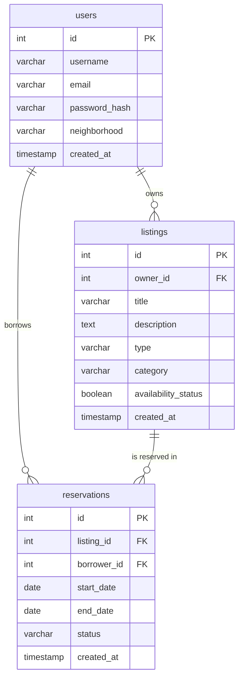

# Entity Relationship Diagram

Reference the Creating an Entity Relationship Diagram final project guide in the course portal for more information about how to complete this deliverable.

## Create the List of Tables

1. **users**: Stores community member accounts, passwords, and neighborhood locations.
2. **listings**: Stores tools and skills shared by users, categorized and marked with status.
3. **reservations**: Stores bookings of listings made by borrowers, including rental duration and status.

## Add the Entity Relationship Diagram

### Table 1: `users`
| Column Name | Type | Description |
|-------------|------|-------------|
| id | SERIAL | Primary Key, uniquely identifies a user |
| username | VARCHAR(50) | Unique username chosen by the user |
| email | VARCHAR(100) | Unique email address used for login |
| password_hash | VARCHAR(255) | Securely hashed password credential |
| neighborhood | VARCHAR(100) | User's neighborhood location to support localized filtering |
| created_at | TIMESTAMP | Timestamp of when the user account was registered |

### Table 2: `listings`
| Column Name | Type | Description |
|-------------|------|-------------|
| id | SERIAL | Primary Key, uniquely identifies a listing |
| owner_id | INTEGER | Foreign Key referencing `users(id)`, identifies the lender |
| title | VARCHAR(100) | Title of the tool or skill being listed |
| description | TEXT | Detailed description of the listing (e.g. tool specs, skill details) |
| type | VARCHAR(20) | Type of listing: either `'tool'` or `'skill'` |
| category | VARCHAR(50) | Category for filtering (e.g., `'Gardening'`, `'Power Tools'`, `'Automotive'`) |
| availability_status | BOOLEAN | Indicates if the item is currently active/available for booking |
| created_at | TIMESTAMP | Timestamp of when the listing was created |

### Table 3: `reservations`
| Column Name | Type | Description |
|-------------|------|-------------|
| id | SERIAL | Primary Key, uniquely identifies a reservation transaction |
| listing_id | INTEGER | Foreign Key referencing `listings(id)`, links to the item reserved |
| borrower_id | INTEGER | Foreign Key referencing `users(id)`, identifies the borrowing user |
| start_date | DATE | The reservation start date (inclusive) |
| end_date | DATE | The reservation end date (inclusive) |
| status | VARCHAR(20) | Reservation status: `'pending'`, `'approved'`, `'completed'`, `'cancelled'` |
| created_at | TIMESTAMP | Timestamp of when the reservation request was submitted |

