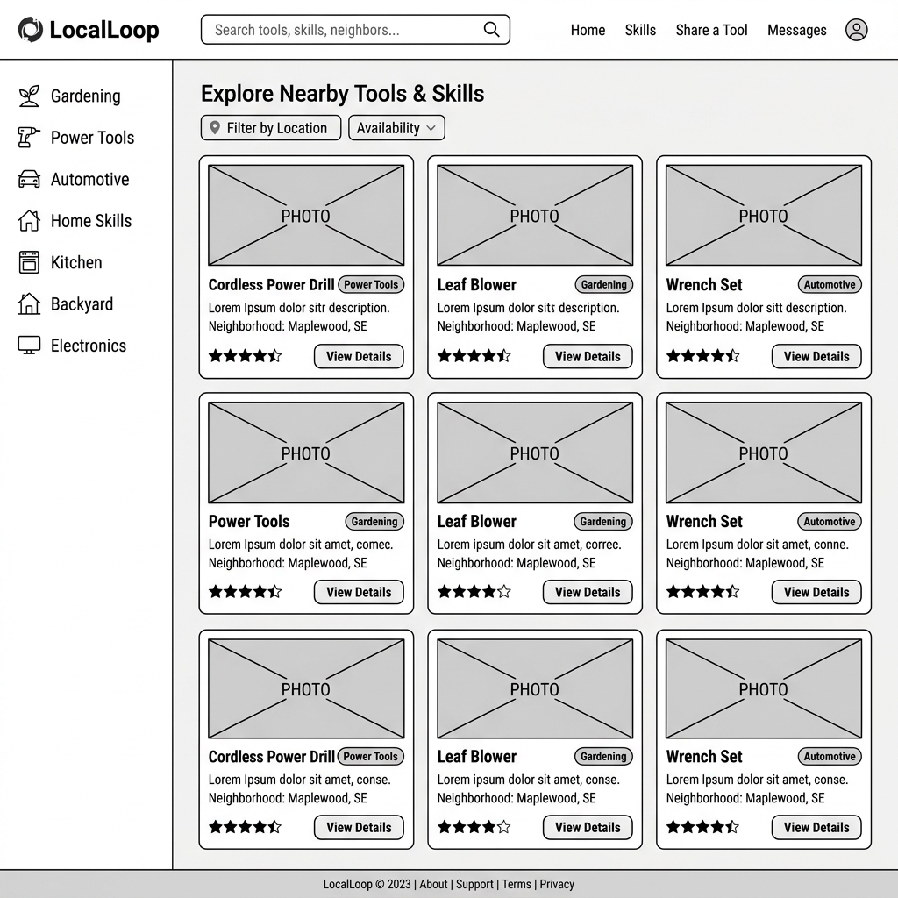
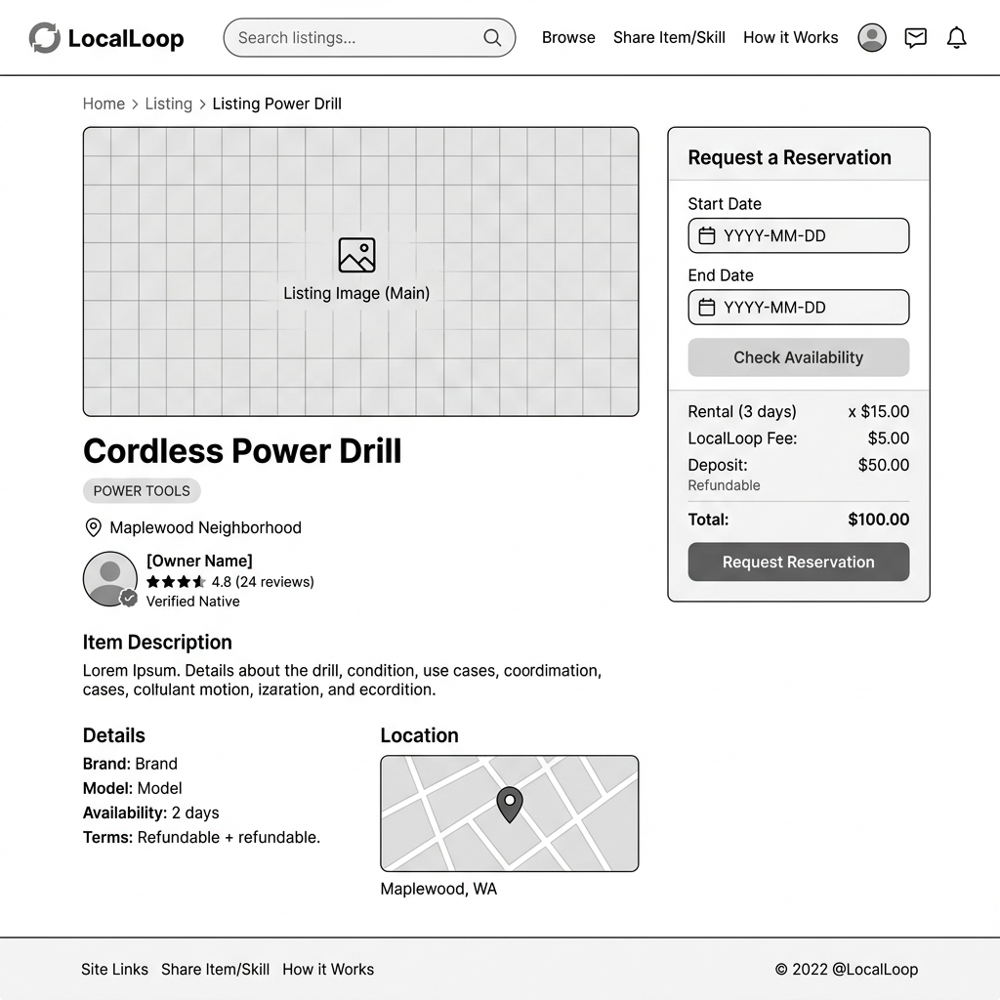
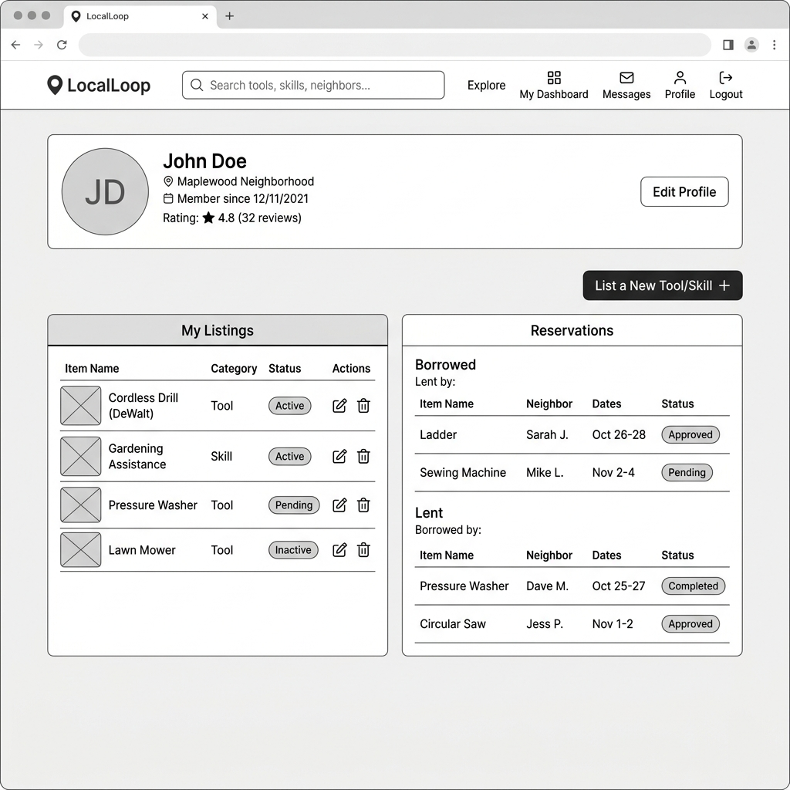

# Wireframes

Reference the Creating an Entity Relationship Diagram final project guide in the course portal for more information about how to complete this deliverable.

## List of Pages

1. **Home Feed / Catalog Page** ⭐ (Wireframed)
2. **Listing Details Page** ⭐ (Wireframed)
3. **User Profile & Dashboard Page** ⭐ (Wireframed)
4. **Tool & Skill Listing Creation Page** (Form/Modal to list new tool/skill)
5. **Direct Messaging / Reservation Chat** (Interface for users to coordinate pickups)

---

## Wireframe 1: Home Feed & Catalog Page

This page serves as the entry point for both guests and logged-in users. It features:
* A navigation bar with the Logo (LocalLoop), global Search Bar, and quick links (Explore, My Dashboard, Messages, Profile, Logout).
* A category filtering sidebar on the left side (Gardening, Power Tools, Automotive, Home Skills, Kitchen, Backyard, Electronics) to refine search queries.
* Availability & location filtering controls.
* A responsive grid of listings displaying a photo placeholder, title, category, neighborhood name, rating, and a "View Details" button.

---

## Wireframe 2: Listing Details Page

This page details a specific tool or skill and provides the reservation interaction. It features:
* A main product image block at the top.
* Key listing attributes: Title ("Cordless Power Drill"), Category ("Power Tools"), Location ("Maplewood Neighborhood"), and Owner profile preview (rating, status).
* A detailed item description text block and map visualization.
* A right-hand sticky "Request a Reservation" card displaying:
  * Interactive date pickers for Start Date and End Date.
  * A "Check Availability" validator.
  * Price breakdown (deposit, fee, and total) for transparent community rental.
  * A primary "Request Reservation" call-to-action button.

---

## Wireframe 3: User Dashboard & Profile Page

This page lets neighbors manage their community activity. It features:
* A top profile header showing user metrics (Avatar initials "JD", name "John Doe", neighborhood, member duration, rating, and "Edit Profile" button).
* A prominent call-to-action button to "List a New Tool/Skill" to start listing new items immediately.
* A split dual-column layout:
  * **My Listings column (Left)**: A tabular CRUD manager for the user's tools and skills with current status badges (Active, Pending, Inactive) and action buttons (Edit/Delete).
  * **Reservations column (Right)**: Categorized lists of upcoming Borrowed tools (Lent by neighbor, dates, status badges: Approved/Pending) and Lent tools (Borrowed by neighbor, dates, status badges: Completed/Approved) to track local logistics.

